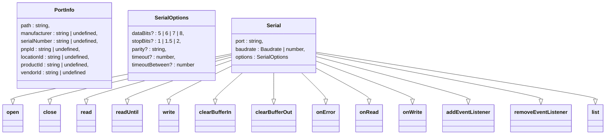

```mermaid
classDiagram
  class PortInfo {
    path : string,
    manufacturer : string | undefined,
    serialNumber : string | undefined,
    pnpId : string | undefined,
    locationId : string | undefined,
    productId : string | undefined,
    vendorId : string | undefined
  }

  class SerialOptions {
    dataBits? : 5 | 6 | 7 | 8,
    stopBits? : 1 | 1.5 | 2,
    parity? : string,
    timeout? : number,
    timeoutBetween? : number
  }

  class Serial {
    port : string,
    baudrate : Baudrate | number,
    options : SerialOptions
  }

  class open {

  }

  class close {
      
  }

  class read {
      
  }

  class readUntil {
      
  }

  class write {
      
  }

  class clearBufferIn {
      
  }

  class clearBufferOut {
      
  }

  class onError {
      
  }

  class onRead {
      
  }

  class onWrite {
      
  }

  class addEventListener {
      
  }

  class removeEventListener {
      
  }

  class list {
      
  }

  Serial --|> open
  Serial --|> close
  Serial --|> read
  Serial --|> readUntil
  Serial --|> write
  Serial --|> clearBufferIn
  Serial --|> clearBufferOut
  Serial --|> onError
  Serial --|> onRead
  Serial --|> onWrite
  Serial --|> addEventListener
  Serial --|> removeEventListener
  Serial --|> list
```
